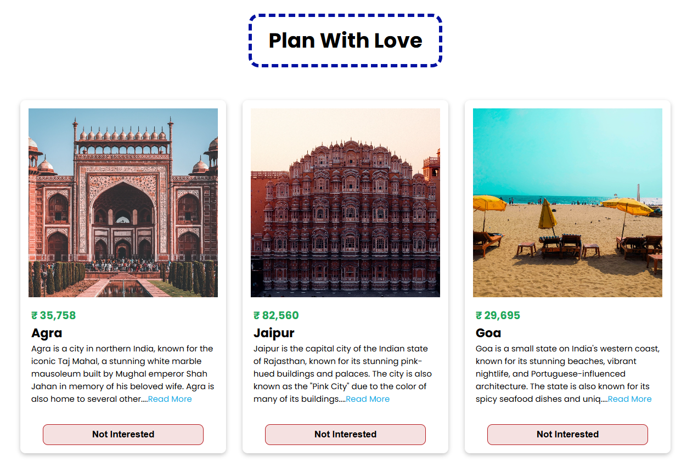

# Plan With Love - Travel Destination App

A beautifully designed **Travel Destination App** built with **ReactJS** and styled with **CSS**, featuring an interactive UI to explore popular destinations. The app displays destination cards with images, descriptions, and prices, and uses **Toast notifications** for user interactions.

## Features

- **Interactive Cards**: Each card displays an image, destination name, price, and a brief description.
- **Toast Notifications**: Users receive real-time notifications when they interact with a card (e.g., clicking "Not Interested").
- **Modern Design**: Clean and responsive layout for a great user experience.
- **Read More Functionality**: Allows users to expand and view the full description.
- **Responsive Layout**: Optimized for desktops, tablets, and mobile devices.

## Tech Stack

- **ReactJS**: JavaScript library for building dynamic user interfaces.
- **CSS**: Custom styling for a visually appealing design.
- **React-Toastify**: For displaying toast notifications.

## Check it out Live : https://plan-with-love-react02.netlify.app/

## Demo



## Installation and Setup

Follow the steps below to set up and run the app locally:

1. Clone the repository:
   ```bash
   git clone https://github.com/your-username/travel-app.git
   cd travel-app


